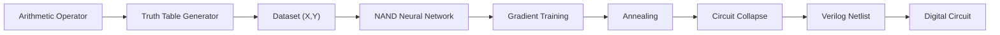
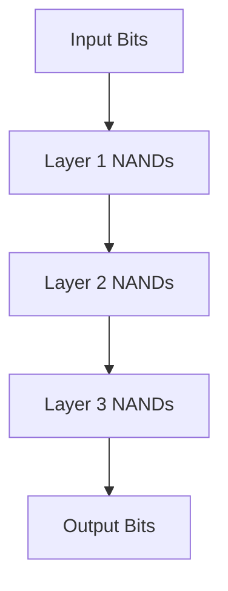
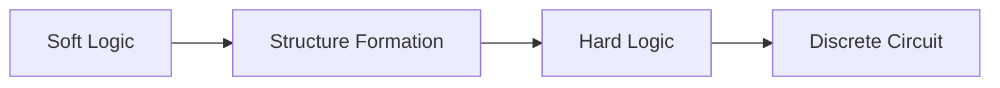
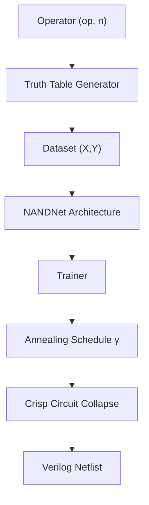

# NeuralNand

### Differentiable NAND Networks for Direct Digital Circuit Synthesis


NeuralNand is a **differentiable neural architecture for synthesizing
digital circuits directly from truth tables** using **only NAND gates**.

The network is trained with gradient descent and then **collapsed into a
hardware‑synthesizable Verilog netlist**, preserving a **1:1 mapping
between neurons and NAND gates**.

------------------------------------------------------------------------

# Project Goal

Train a neural network composed exclusively of NAND neurons and convert
it into a **real digital circuit**.

The network learns logic structure during training and eventually
**crystallizes into a discrete Boolean circuit**.

------------------------------------------------------------------------

# High‑Level Architecture



------------------------------------------------------------------------

# NAND Neuron

Each neuron is a **differentiable relaxation of a NAND gate**.

Forward equation:

f(a,b,T) = 1 − σ(T (w₁a + w₂b − 1.5))

Where

-   σ is the sigmoid
-   T is temperature controlling gate hardness

As **T → ∞**, the neuron becomes an exact NAND gate.

Design constraints:

-   Bias fixed at −1.5
-   Weights constrained positive using softplus

------------------------------------------------------------------------

# Network Structure



Properties:

-   Fixed arity: **2 inputs per neuron**
-   Direct mapping to hardware
-   DAG topology
-   Skip connections to inputs

------------------------------------------------------------------------

# Training Dynamics

Training uses **annealing** to gradually transform soft logic into
discrete gates.



A single scalar **γ** controls:

-   Gate temperature
-   Routing hardness
-   Loss weighting
-   Regularization

------------------------------------------------------------------------

# Loss Function

Total loss:

L = α L_wbce + β L_arith + λ L_reg

Components:

### Weighted BCE

Bit-level accuracy with MSB emphasis.

### Arithmetic Loss

Measures numeric error of the integer result.

### Regularization

Encourages NAND symmetry:

(w₁ − 1)² + (w₂ − 1)²

------------------------------------------------------------------------

# Dataset Generation

Instead of datasets, the system generates **complete truth tables**.

  Operator   Inputs   Outputs
  ---------- -------- ---------
  add        2n       n+1
  sub        2n       n+1
  mul        2n       2n
  cmp        2n       1
  max        2n       n
  min        2n       n

Example: 4-bit addition produces **256 rows**.

------------------------------------------------------------------------

# Example Training Pipeline



------------------------------------------------------------------------

# Example Usage

``` python
from neuralnand import train

model = train(
    operator="add",
    bits=4
)

model.export_verilog("adder4.v")
```

Example generated gate:

``` verilog
nand g0 (w0, a0, b0);
nand g1 (w1, w0, a1);
nand g2 (sum0, w1, carry0);
```

------------------------------------------------------------------------

# Research Motivation

NeuralNand investigates whether neural training can act as a **circuit
discovery mechanism**.

Instead of designing circuits manually, the network **learns Boolean
structure from data**.

Key research questions:

-   Can NAND-only networks learn arbitrary Boolean functions?
-   How optimal are the resulting circuits?
-   Can approximate circuits emerge naturally?
-   How does circuit complexity scale with bit width?

------------------------------------------------------------------------

# Related Work

  Feature            NeuralNand          Differentiable Logic Gate Networks
  ------------------ ------------------- ------------------------------------
  Gate set           NAND only           Multiple gates
  Hardware mapping   Direct              Requires synthesis
  Training target    Circuit synthesis   Classification
  Output             Verilog circuit     Logical inference

------------------------------------------------------------------------

# References

### Differentiable Logic Networks

Petersen, F. et al. (2022)\
Deep Differentiable Logic Gate Networks\
NeurIPS 2022\
https://arxiv.org/abs/2210.08277

Petersen, F. et al. (2024)\
Convolutional Differentiable Logic Gate Networks\
https://arxiv.org

------------------------------------------------------------------------

### Discretization Gap

Yousefi, A. et al. (2025)\
Mind the Gap: Removing the Discretization Gap in Differentiable Logic
Gate Networks\
https://arxiv.org/abs/2506.07500

------------------------------------------------------------------------

### Straight‑Through Estimators

Kim, T. (2025)\
Align Forward, Adapt Backward\
https://arxiv.org/abs/2603.14157

------------------------------------------------------------------------

### Logic Synthesis of Neural Networks

Chi, Y. & Jiang, J.\
Logic Synthesis of Binarized Neural Networks

Murovic, T. & Trost, A. (2019)\
Massively Parallel Combinational Binarized Neural Networks

------------------------------------------------------------------------

# Installation

``` bash
git clone https://github.com/guinamen/NeuralNand
cd NeuralNand
pip install -r requirements.txt
```

------------------------------------------------------------------------

# Roadmap

Planned improvements:

-   Hard Straight‑Through training
-   Gumbel routing
-   Automatic circuit simplification
-   Hardware‑aware training
-   FPGA benchmarking

------------------------------------------------------------------------

# Vision

NeuralNand explores a broader concept:

> Neural networks can function as **program synthesizers that generate
> symbolic computational artifacts**.

In this case, the artifact is a **digital circuit**.

------------------------------------------------------------------------

# License

MIT
